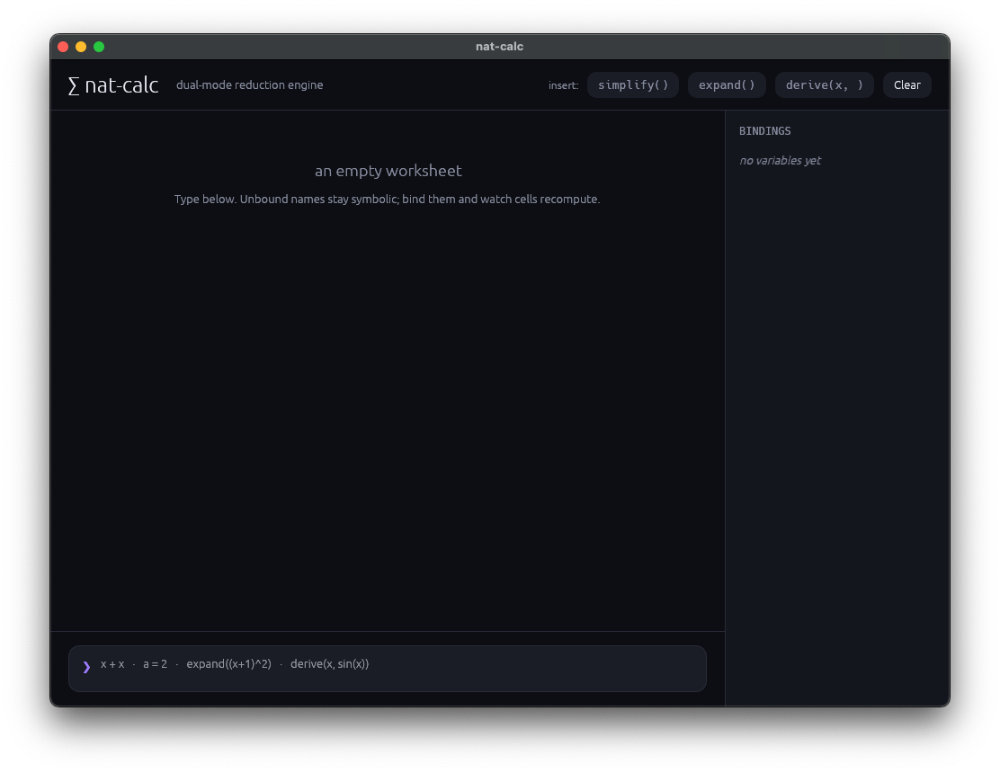
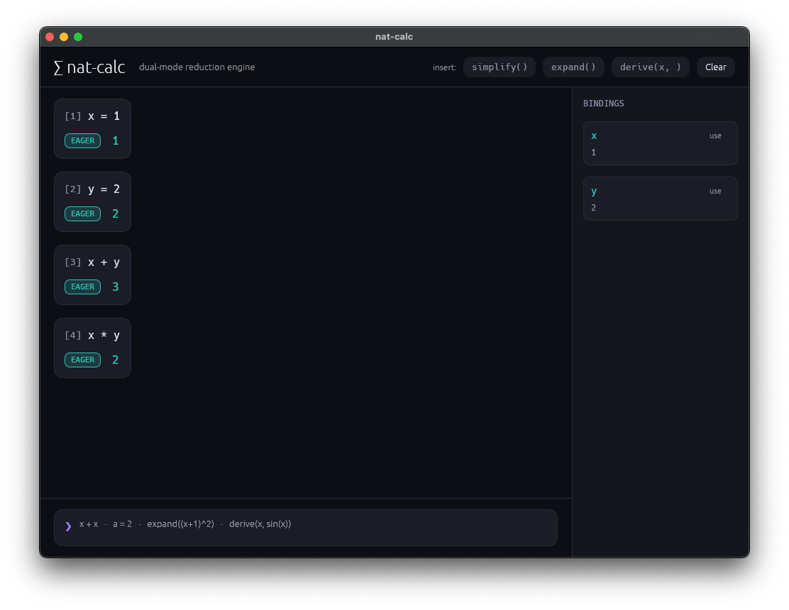

# nat-calc

A dual-mode (eager and lazy) term-rewriting calculator. It is a single
reduction engine: every expression is recursively simplified rather than
"evaluated". Depending on what is known, the same expression reduces either
to a terminal value (a number or a matrix) or to a simplified symbolic AST.

It supports exact arithmetic, a small computer-algebra layer (simplify,
expand, symbolic differentiation), numeric matrices, and untyped lambda
calculus. It runs as a native desktop GUI, an interactive REPL, or in the
browser via WebAssembly.

## Screenshots





## Contents

- [Reduction modes](#reduction-modes)
- [Building and running](#building-and-running)
- [Configuration](#configuration)
- [Language reference](#language-reference)
  - [Numbers](#numbers)
  - [Operators and precedence](#operators-and-precedence)
  - [Variables and assignment](#variables-and-assignment)
  - [Eager vs lazy (implicit switching)](#eager-vs-lazy-implicit-switching)
  - [Delayed binding](#delayed-binding)
  - [Explicit commands: simplify, expand, derive](#explicit-commands)
  - [Functions](#functions)
  - [Matrices](#matrices)
  - [Lambda calculus](#lambda-calculus)
- [Limits and safety](#limits-and-safety)
- [Error reference](#error-reference)
- [A worked session](#a-worked-session)
- [GUI guide](#gui-guide)
- [Architecture](#architecture)
- [Troubleshooting](#troubleshooting)
- [Known limitations](#known-limitations)

## Reduction modes

Every result is classified into one mode. The GUI shows each as a colored
badge.

| Mode | Meaning | Example input | Result |
|------|---------|---------------|--------|
| EAGER | Reduced to a number | `2 + 3 * 4` | `14` |
| LAZY | Reduced to a symbolic AST (an unbound variable was involved) | `x + x` | `(2 * x)` |
| MATRIX | Reduced to a numeric matrix | `2 * [1, 2; 3, 4]` | `[2, 4; 6, 8]` |
| LAMBDA | Reduced to a lambda abstraction | `\x. x` | `(\x. x)` |
| ERROR | Reduction failed | `1 / 0` | `division by zero` |

Symbolic results are always fully parenthesized so the structure is
unambiguous, for example `((x ^ 2) + (2 * x))`.

## Building and running

Requires a recent stable Rust toolchain (edition 2024).

Native GUI (default binary):

```
cargo run
```

Interactive REPL (line editing, history):

```
cargo run --bin repl
```

Run the test suite:

```
cargo test
```

### Web (WebAssembly)

The GUI compiles to wasm and runs in a browser via
[Trunk](https://trunkrs.dev/):

```
trunk serve      # dev server with live reload
trunk build      # static bundle in ./dist
```

Note: if your environment sets `NO_COLOR=1`, Trunk 0.22-beta misparses it.
Run Trunk as `env NO_COLOR=true trunk build` (or `trunk serve`).

## Configuration

The REPL reads an optional config file at `~/.nat_calc.conf`. It is a
minimal `key = value` format; lines starting with `#` are comments. A
missing file means defaults (history enabled).

| Key | Values | Default | Effect |
|-----|--------|---------|--------|
| `history` | `true`/`false`/`1`/`0`/`yes`/`no`/`on`/`off` | `true` | Enable history navigation and line editing (Up/Down arrows). When off, plain line input. |
| `history_file` | a path (`~/` expanded) | `~/.nat_calc_history` | Where persistent REPL history is stored. |

Example `~/.nat_calc.conf`:

```
# disable line editing, use plain stdin
history = false
```

## Language reference

One expression (or assignment) per line.

### Numbers

Arbitrary-precision decimals (backed by `BigDecimal`); arithmetic is exact,
no floating-point rounding.

```
10 / 4        -> 2.5
1 / 3         -> 0.3333...  (rendered at high fixed precision, ~100 digits)
2.5e-3        -> 0.0025     (scientific notation accepted)
.5            -> 0.5
```

### Operators and precedence

| Operator | Meaning | Associativity | Precedence |
|----------|---------|---------------|------------|
| `^` | exponentiation | right | highest |
| unary `-` | negation | prefix | below `^` |
| `*` `/` | multiply, divide | left | middle |
| `+` `-` | add, subtract | left | lowest |

```
2 + 3 * 4     -> 14      (* before +)
(2 + 3) * 4   -> 20
2 ^ 3 ^ 2     -> 512     (right-associative: 2 ^ (3 ^ 2) = 2 ^ 9)
-2 ^ 2        -> -4      (unary minus is looser than ^: -(2 ^ 2))
```

Integer powers are computed exactly. A non-integer exponent on numbers is
kept symbolic rather than approximated.

### Variables and assignment

```
a = 2         -> 2       (assignment returns the value)
a + 10        -> 12
```

Variables store the unevaluated expression, not just a primitive, which is
what enables lazy evaluation and delayed binding.

### Eager vs lazy (implicit switching)

The mode is chosen automatically. If every variable in an expression
resolves to a number, arithmetic runs (eager). If any variable is unbound,
the whole expression gracefully falls back to a simplified symbolic form
(lazy).

```
x + x         -> (2 * x)        LAZY  (x unbound; like terms grouped)
x * 1         -> x              LAZY  (identity elimination)
x + 0         -> x              LAZY
x * 0         -> 0              EAGER (annihilation folds to a number)
x - x         -> 0              EAGER
1 + 2 + y     -> (y + 3)        LAZY  (constants still fold)
```

### Delayed binding

A symbolic binding re-resolves once its dependencies become numeric.

```
x = a + b     -> (a + b)        LAZY  (a, b unbound)
a = 2         -> 2
b = 3         -> 3
x             -> 5              EAGER (re-triggered reduction)
```

In the GUI this is live: every cell re-evaluates whenever you submit, so a
later binding visibly flips earlier cells from LAZY to EAGER.

### Explicit commands

These force the symbolic (lazy) path and operate on the AST structurally.
They deliberately ignore bindings, so they work even when a variable has a
numeric value.

`simplify(e)` applies the rewrite rules to a fixpoint:

```
simplify(x + x + x)      -> (3 * x)
simplify(2 * x + 3 * x)  -> (5 * x)
```

Rewrite rules include: constant folding, identity elimination
(`x*1`, `x+0`), annihilation (`x*0`), like-term grouping
(`x + x -> 2*x`), equal-base power collection (`x*x -> x^2`),
double negation, and exponent identities (`x^1`, `x^0`, `1^x`, `0^n`).

`expand(e)` multiplies products out, then simplifies. It does exactly two
things: distribute `*` over `+`/`-`, and unroll small integer powers of a
sum into repeated multiplication. It does not split fractions or distribute
division.

```
expand((x + 1) ^ 2)        -> (((x ^ 2) + (2 * x)) + 1)
expand((x + 1) ^ 3)        -> ((((x ^ 3) + (3 * (x ^ 2))) + (3 * x)) + 1)
expand(x * (y + z))        -> ((x * y) + (x * z))
expand((x ^ 3) / 3)        -> ((x ^ 3) / 3)   (nothing to distribute)
expand((a + b) ^ 2)        -> ((((a ^ 2) + (a * b)) + (b * a)) + (b ^ 2))
```

Note the last example: `a * b` and `b * a` are not merged. Like-term
collection compares terms structurally and does not commutatively normalize
products, so `a*b + b*a` stays as two terms rather than `2 * a * b`.

`derive(var, e)` symbolic differentiation with respect to `var`:

```
derive(x, x ^ 2)         -> (2 * x)
derive(x, x ^ 3)         -> (3 * (x ^ 2))
derive(x, x * x)         -> (2 * x)
derive(x, sin(x))        -> cos(x)
derive(x, cos(x))        -> -(sin(x))
derive(x, exp(x))        -> exp(x)
derive(x, ln(x))         -> (1 / x)
derive(x, sin(x) + x^2)  -> (cos(x) + (2 * x))
```

Rules covered: power, sum, difference, product, quotient, and chain rule
over `+ - * / ^`, plus the transcendental functions below.

### Functions

Built-in functions: `sin`, `cos`, `tan`, `exp`, `ln`. They are kept exact:
rather than producing a lossy floating-point number, they reduce
symbolically and only fold known identities.

```
sin(0)        -> 0
cos(0)        -> 1
exp(0)        -> 1
ln(1)         -> 0
sin(x)        -> sin(x)     (stays symbolic; exact)
```

### Matrices

Row-major literals: rows separated by `;`, elements by `,`. Elements must
reduce to numbers.

```
[1, 2; 3, 4]
```

Supported operations:

| Operation | Form | Example | Result |
|-----------|------|---------|--------|
| Add / subtract | `A + B`, `A - B` (same dimensions) | `[1,2;3,4] + [1,1;1,1]` | `[2, 3; 4, 5]` |
| Scalar multiply | `s * A` or `A * s` | `2 * [1,2;3,4]` | `[2, 4; 6, 8]` |
| Scalar divide | `A / s` | `[2,4;6,8] / 2` | `[1, 2; 3, 4]` |
| Matrix multiply | `A * B` (cols A = rows B) | `[1,2;3,4] * [5,6;7,8]` | `[19, 22; 43, 50]` |

Dimension mismatches are reported as errors:

```
[1, 2] + [1, 2; 3, 4]   -> type mismatch: matrix dimension mismatch for +/-
```

### Lambda calculus

Untyped lambda calculus, integrated with the rest of the engine.

Abstraction uses a backslash; multi-parameter is sugar for nested lambdas:

```
\x. x                 -> (\x. x)              LAMBDA
\x y. x               == \x. \y. x
```

Application is written `f(arg)`, and is curried:

```
(\x. x)(5)            -> 5
(\x. x + 1)(4)        -> 5
(\x. \y. x)(7)(9)     -> 7
(\x y. x)(1, 2)       -> 1     (f(a, b) == f(a)(b))
```

A binding that holds a lambda is a user-defined function:

```
inc = \x. x + 1
inc(9)                          -> 10
compose = \f. \g. \x. f(g(x))
dbl = \x. x * 2
compose(inc)(dbl)(10)           -> 21
```

Lambdas close over the environment, and the capture follows delayed
binding:

```
a = 10
addA = \x. x + a
addA(5)               -> 15
a = 100
addA(5)               -> 105
```

Higher-order functions work as expected:

```
twice = \f. \x. f(f(x))
twice(\y. y + 1)(10)  -> 12
```

Substitution is capture-avoiding (bound variables are alpha-renamed when
needed):

```
(\x. \y. x)(y)        -> (\y'. y)
```

Reduction is normal-order to normal form, with a step cap so divergent
terms fail safely instead of hanging:

```
(\x. x(x))(\x. x(x))  -> rewrite limit exceeded
```

## Limits and safety

The engine is designed not to hang or crash on pathological input.

| Guard | Limit | Triggered by | Result |
|-------|-------|--------------|--------|
| AST node count | `MAX_NODES` (10,000) | combinatorial expansion, e.g. `expand((x + y) ^ 14)` | `expression too large` |
| Rewrite iterations | `MAX_REWRITE_DEPTH` (50) | non-converging simplification | `rewrite limit exceeded` |
| Beta-reduction steps | `MAX_BETA_STEPS` (100,000) | divergent lambda terms (omega) | `rewrite limit exceeded` |
| Division by zero | n/a | `1 / 0`, `A / 0` | `division by zero` |
| Cyclic bindings | n/a | `y = y + y`, `a = b; b = a` | the recursive occurrence becomes a free symbol; e.g. `y` then yields `(2 * y)` instead of recursing forever |

Expansion is bounded before allocation: the product-term count is checked
before building the tree, so a blowup is rejected cheaply.

## Error reference

| Message | Cause |
|---------|-------|
| `lex error: ...` | unrecognized character |
| `parse error: ...` | malformed syntax |
| `division by zero` | denominator reduced to 0 |
| `expression too large (exceeded MAX_NODES)` | expansion/simplification blew up |
| `rewrite limit exceeded (MAX_REWRITE_DEPTH)` | simplification or beta-reduction did not terminate |
| `type mismatch: ...` | shape/kind error (matrix dimensions, function applied to a matrix, differentiating a matrix or lambda) |

## A worked session

```
> price = 19.99
19.99
> qty = 3
3
> price * qty
59.97
> total = price * qty + shipping
(shipping + 59.97)          # shipping unbound -> LAZY
> shipping = 5
5
> total
64.97                       # delayed binding resolved -> EAGER
> derive(t, 3 * t ^ 2 + 2 * t)
((6 * t) + 2)
> id = \x. x
(\x. x)
> id(id)(42)
42
> rotate = \theta. [cos(theta), 0; 0, cos(theta)]
(\theta. [cos(theta), 0; 0, cos(theta)])
```

## GUI guide

The desktop/web app is a reactive worksheet:

- Type an expression in the prompt at the bottom and press Enter; it
  becomes a cell showing `input -> result` with a mode badge.
- The right-hand Bindings panel lists every variable live; `use` inserts a
  name into the prompt.
- Every submission re-evaluates all cells in order, so delayed binding is
  visible: bind a variable and earlier cells recompute.
- `simplify()`, `expand()`, `derive(x, )` chips insert templates; `Clear`
  empties the worksheet.

## Architecture

A single reduction engine; data flows downward, no shared mutable state.

| Module | Responsibility |
|--------|----------------|
| `lexer` | source text to tokens |
| `parser` | tokens to AST (Pratt parser) |
| `ast` | the `Expr` enum |
| `engine` | the unified reducer, `Environment`, eager/lazy/matrix/lambda dispatch |
| `simplify` | algebraic rewrite rules (bounded, pure) |
| `expand` | distribute products, unroll powers (bounded) |
| `derive` | symbolic differentiation |
| `lambda` | capture-avoiding substitution, normal-order beta reduction |
| `numeric` | exact integer power, exponent helpers |
| `config` | REPL configuration loading |
| `app` | the egui/eframe GUI |

## Troubleshooting

- "It returned a symbolic expression, I wanted a number." A variable in the
  expression is unbound, or you used `simplify`/`expand`/`derive` (which
  ignore bindings by design). Bind the variables, or omit the command.
- "expand did nothing." There was no product over a sum and no power of a
  sum to multiply out; the input was already expanded.
- A function call like `f(2)` where `f` is undefined is treated as lambda
  application of an unbound `f`, so it stays symbolic, not an error.
- Trunk fails with `invalid value '1' for '--no-color'`: run it as
  `env NO_COLOR=true trunk build`.

## Known limitations

These are intentional scope boundaries, not bugs:

- No natural-language numbers. `one + two` treats `one` and `two` as
  variables, giving `(one + two)`.
- Not an equation solver. `y = y + y` does not solve for `y`; it stores a
  self-referential binding and `y` reduces to the symbolic `(2 * y)`.
- `expand` does not split fractions or distribute division; `(x^3)/3` stays
  `(x ^ 3) / 3`.
- Like-term collection is structural, not commutative: `a*b` and `b*a` are
  treated as distinct, so they are not combined.
- Matrices are numeric only; there are no symbolic matrices.
- Lambda terms cannot be differentiated.
- Transcendental functions are exact/symbolic only; they are not evaluated
  to decimal approximations.
